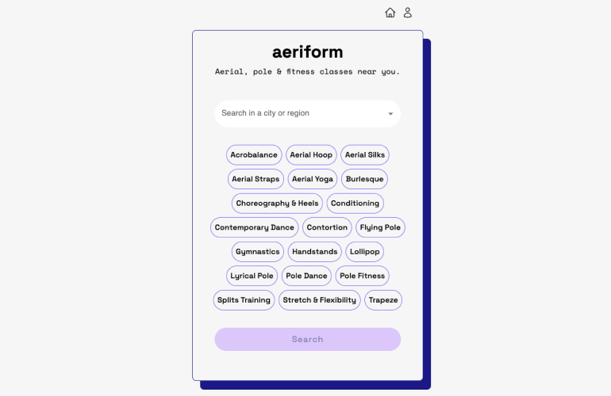
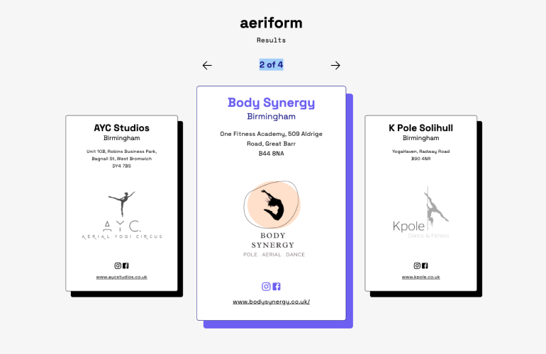
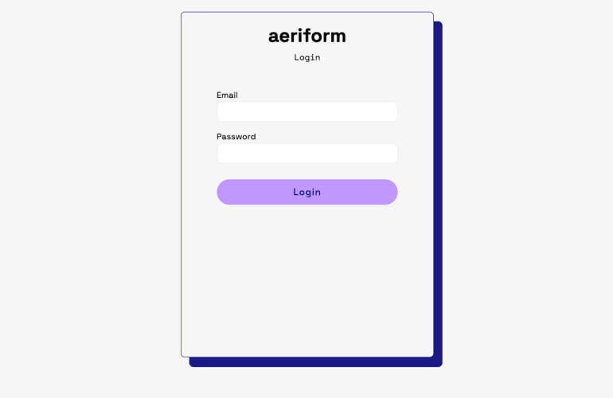
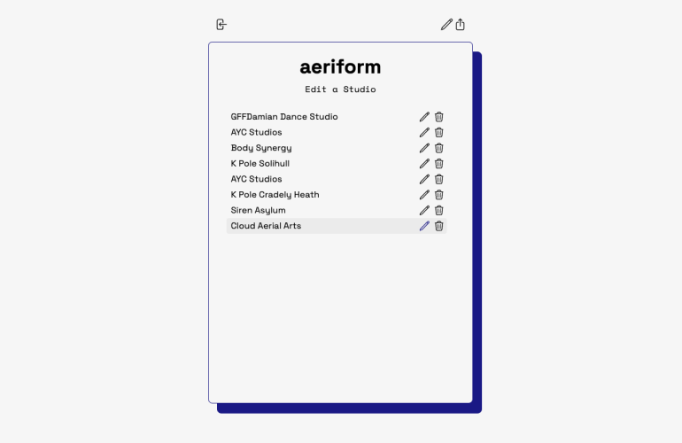
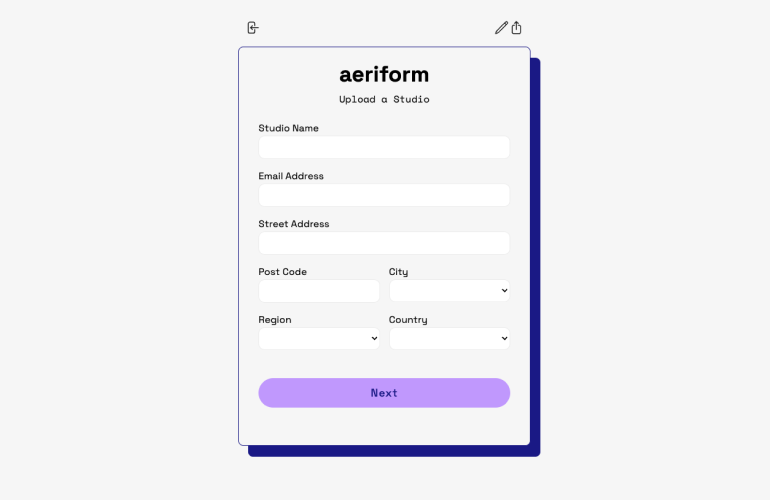

# Aeriform
Aeriform is a full-stack, web app project. Aeriform allows users to search for aerial, pole, and fitness studios in the UK. The app currently only focuses on the West Midlands region.

[https://aeriform.vercel.app](https://aeriform.vercel.app/)

## Table of Contents

- [Features](#features)
- [Screenshots](#screenshots)
- [Technologies Used](#technologies-used)

## Features
### Search
The search page is part of the homepage. Users can select a city and fitness speciality to search for.

### Results
The results page displays the results from the user's search. The results are displayed on cards that include information on each studio such as the location, contact details, and their logo.

### Login
There is an option to login. This currently leads to the admin portal, where there is the ability for an admin to upload, edit, and delete studios.

## Technologies Used
The project began as a MERN stack project, using MongoDB for the database. It then evolved to use AWS services for the backend.

The **Frontend** is a React app hosted on Vercel.

- ReactJS
- Tailwind CSS
- Jest
- React Testing Library

 

The **Backend** is a serverless Express app.

- Serverless Framework
- ExpressJS
- NodeJS
- AWS Lambda
- AWS DynamoDB

## Screenshots

